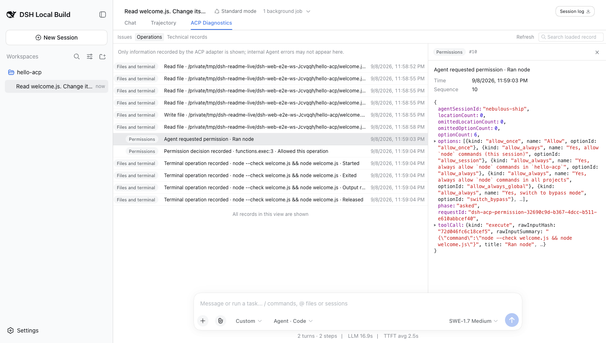
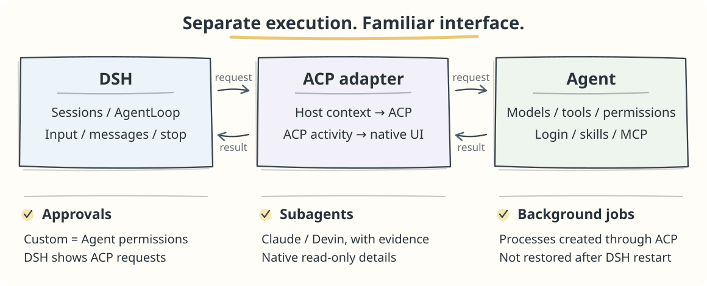

# ACP adapter

[中文](README.md)

Use **Claude · Codex · Devin · Kimi** from the DSH session UI.

> **0.1.3-alpha.2** · Requires **DSH 0.1.3-alpha.2**

##  Preview

Screenshots show real **Devin · SWE-1.7 Medium** operations in a clean DSH instance.

Add an Agent, check its connection, and see the plugin version:


Use Agent models, reasoning effort, and native tool presentation in a DSH session:


ACP approvals reuse DSH's native approval card, with the full command visible before approval:


View the subagent's actual findings in DSH's native read-only detail view:


ACP Diagnostics groups issues, operations, and technical records. Open a record for its recorded cause; search covers loaded records.



##  Prerequisite: install a supported DSH version

You need Node.js `^22.19.0 || >=24.0.0`:

```bash
npx @deepseek-ai/dsh@0.1.3-alpha.2 web
```

Plugin development installs the locked npm dependencies:

```bash
pnpm install --frozen-lockfile
```

Regular development needs no upstream checkout. See the [E2E guide](test/e2e/README.md) for browser regression setup.

##  Connect in three steps

**1. Install and sign in to your Agent.**

| Agent | ACP command | Terminal login |
| --- | --- | --- |
| Claude | `claude-agent-acp` | `claude` |
| Codex | `codex-acp` | `codex login`¹ |
| Devin | `devin acp` | `devin auth login` |
| Kimi | `kimi acp` | `kimi login` |

¹ ChatGPT sign-in requires the separate Codex CLI.

**2. Install the plugin.** This command installs the published npm `alpha` version.

```bash
npx @deepseek-ai/dsh@0.1.3-alpha.2 plugin --profile web add @zaimokuza/dsh-acp-adapter@alpha
```

**3. Open Settings → ACP adapter**, add a template, check the connection, then choose an Agent model in a new session.

If the Agent needs an API key, add it explicitly under **Connection settings → Environment**; parent-process secrets are not inherited automatically.

##  How it fits together



##  Update or remove

Use the same `DSH_HOME` and profile as when starting DSH. You can replace `npx` with `pnpm dlx`; keep the host version pinned.

```bash
# Update
npx @deepseek-ai/dsh@0.1.3-alpha.2 plugin --profile web update @zaimokuza/dsh-acp-adapter
# Remove
npx @deepseek-ai/dsh@0.1.3-alpha.2 plugin --profile web remove @zaimokuza/dsh-acp-adapter
```

**This update needs no data reset.** Existing SQLite bindings and history remain. Restart DSH after the current turn, then refresh the page; check the loaded version beside the settings title. Very early JSONL-only development data is excluded—see [compatibility notes](test/e2e/REGRESSION.md#2026-09-08双语文档与旧数据兼容核查).

##  If something goes wrong

| Symptom | First check |
| --- | --- |
| Command will not start | Verify the executable path; try its absolute path. |
| Login or authentication fails | Sign in through the Agent CLI; check its configured environment variables. |
| Session needs recovery | Follow the composer notice and **ACP Diagnostics**. Do not clear local data. |

Still stuck? Include the error reference, plugin/DSH versions and relevant host log excerpt in an [issue](https://github.com/zaimokuza-yoshiteru/dsh-acp-adapter/issues). Remove secrets before sharing logs.
