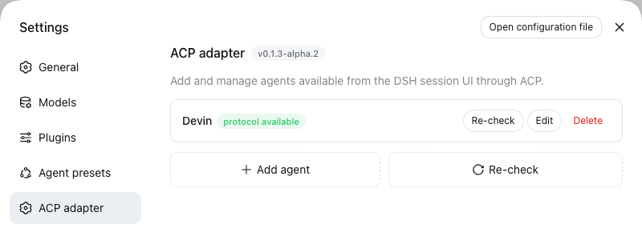
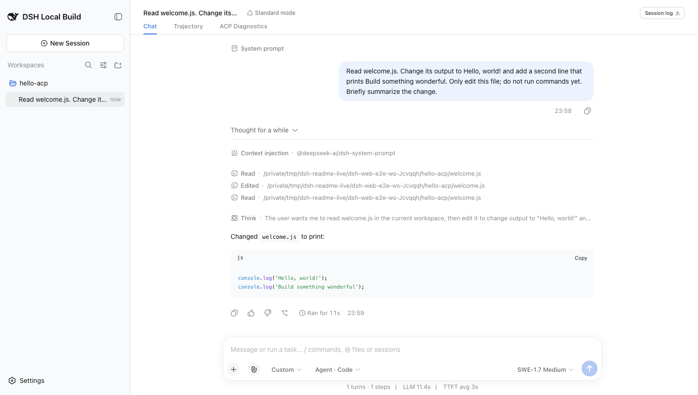
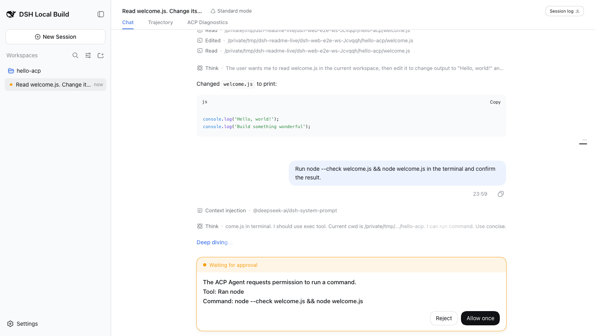
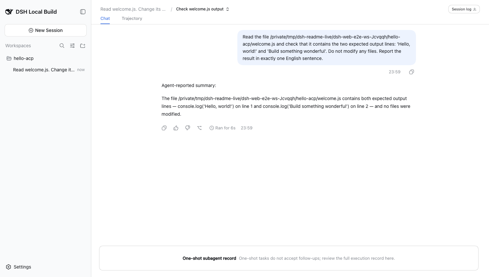
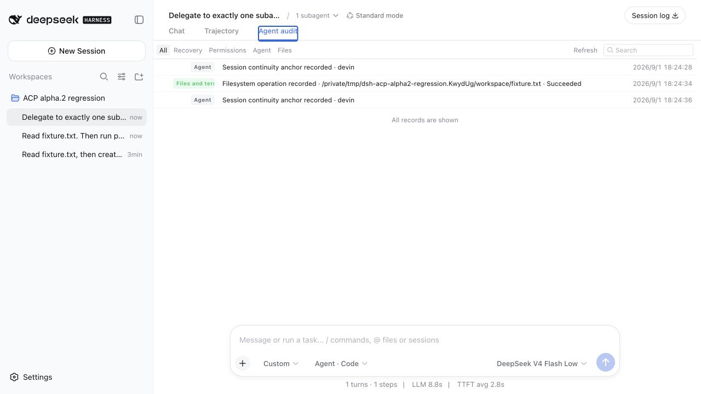

# @zaimokuza/dsh-acp-adapter

[中文](README.md)

Use Devin, Codex, Kimi, or Claude agents from the DeepSeek Harness (DSH) session UI. Each Agent remains responsible for its own model, tools, skills, login state, and runtime.

This version supports DSH `>=0.1.2-alpha.4 <0.1.3`. Development and release builds
use the exact published rc.1 packages; CI additionally verifies the minimum
supported version and the current npm prerelease, while local source links cover the
rc.1 upstream-source compatibility lane.

## Preview

Add Agents in the ACP panel and check that their local ACP commands are available:



Use Agent models, reasoning effort, and native tools in a DSH session:



ACP approvals reuse DSH's native question card. The complete command remains multiline, visible, and copyable before approval:



Subagent calls remain visible in the DSH message flow:



Use Agent audit to inspect permissions, recovery, files, configuration, and session-continuity records:



## Prerequisite: install a supported DSH version

You need Node.js `^22.19.0 || >=24.0.0`:

```bash
npx @deepseek-ai/dsh@0.1.2-rc.1 web
```

Plugin development installs exact published dependencies directly:

```bash
pnpm install --frozen-lockfile
```

For an additional source-level check, build `dsh-v0.1.2-rc.1` and run
`pnpm setup:source-reference`. This compatibility lane only changes this
checkout's development links and never touches the DSH user directory.

## Install the plugin

Run this on the machine running DSH:

```bash
npx @deepseek-ai/dsh@0.1.2-rc.1 plugin --profile web add @zaimokuza/dsh-acp-adapter@next
npx @deepseek-ai/dsh@0.1.2-rc.1 web
```

Open DSH's ACP panel, select a built-in Agent template, provide any required executable configuration, and run the health check. The model picker shows models and options returned by the ACP session.

## Install and sign in to an Agent

Prefer installing and signing in through the Agent's own CLI before running the ACP-panel check. For isolation, ACP subprocesses do not automatically inherit parent environment variables whose names resemble `KEY`, `TOKEN`, `SECRET`, or `PASSWORD`. Only when an Agent has no suitable login or credential store should you explicitly add its required variables in the ACP profile's connection settings. Secret-looking values are masked in the settings UI but remain user-managed configuration.

### Devin

```bash
devin --version
devin auth login
devin auth status
devin acp --help
```

### Codex

`codex-acp` is the ACP executable and includes a compatible Codex runtime. To
sign in with a ChatGPT account, install the Codex CLI separately and run
`codex login`. If an API key is required, explicitly configure the environment
variable supported by Codex in the ACP profile; exporting `CODEX_API_KEY` or
`OPENAI_API_KEY` only before starting DSH does not bypass subprocess credential
isolation. The plugin does not call ACP `authenticate` on the Agent's behalf.

```bash
codex-acp --version
codex-acp --help
# Only for ChatGPT sign-in when the Codex CLI is installed:
codex login
```

### Kimi

```bash
kimi --version
kimi login
kimi doctor
kimi acp --help
```

### Claude

```bash
claude --version
claude-agent-acp --version
claude-agent-acp --help
```

If you are not signed in, prefer running `claude` and following its terminal prompts. When using a compatible endpoint that requires environment variables, explicitly configure the variables required by that Agent in its ACP profile.

## Native Agent Access and boundaries

ACP sessions automatically use Native Agent Access. The DSH permission control shows the derived `Custom` state only to indicate that the Agent owns permission management; changing that DSH control does not change the Agent's actual authority. The Agent can use its own configuration, login state, data home, skills, and MCP definitions. The Agent's own mode governs its behavior; the plugin only presents approval requests that the Agent chooses to send through ACP and cannot constrain Agent tools that bypass that flow. Connect only local Agents you trust.

The plugin does not inject DSH MCP servers into the Agent, read private DSH configuration, or ask you to duplicate MCP JSON. MCP servers and skills already configured in the Agent continue to work. Crossing between a native provider and an ACP Agent in a session that already has history explicitly requires a new session; history is not implicitly migrated. Model switching inside a native provider keeps DSH's original behavior and is not intercepted by ACP session handling.

Native-provider tools run in DSH's AgentLoop, so Chat can show a native tool count and Trajectory can list every tool call. An ACP Agent executes tools in its own process: the plugin does not forge `tool/call` events that would make DSH execute an operation twice, but normalizes ACP activity and hands details to DSH's public Terminal, Read, and Diff components. The host's generic ToolRow is not exposed as a public component, so the ACP outer row copies that specification instead of creating Agent-specific styling. DSH Trajectory still records only provider requests actually dispatched by DSH; protocol evidence remains in Agent audit.

DSH's Stop action first sends the ACP `session/cancel` notification and waits for the active prompt to settle; after a normal cancellation, the connection and session remain reusable. The plugin terminates the Agent process and enters recovery only when the Agent still ignores cancellation after the bounded wait.

The plugin automatically keeps successful external delegations with provable identity, task, and result as native read-only DSH subagent sessions. Devin and Claude are currently eligible; Kimi and Codex remain visible only as the ACP activity they actually expose. The details page uses native user and assistant messages for the task and the final output or an explicitly labelled summary exposed by the Agent. It is not a continuable DSH subagent and does not invent unexposed internal work. Delegations with incomplete evidence or a failed outcome do not create catalog records.

## Upgrade and uninstall

Upgrade an installed plugin with:

```bash
npx @deepseek-ai/dsh plugin --profile web update @zaimokuza/dsh-acp-adapter
```

### Prerelease data compatibility

ACP sidecar data is not guaranteed to remain compatible until the stable
`0.1.0` release. If an old session reports “ACP session recovery required” or
`profile-changed` after an upgrade, stop DSH, then back up and recreate the
plugin's private data:

macOS / Linux:

```bash
mv "$HOME/.dsh/dsh-acp" "$HOME/.dsh/dsh-acp.backup"
```

Windows PowerShell:

```powershell
Rename-Item "$env:USERPROFILE\.dsh\dsh-acp" "dsh-acp.backup"
```

Restart DSH and create a brand-new DSH session. This directory contains only
the plugin's ACP bindings, recovery state, audit data, option snapshots, and
model-switch transactions. It does not contain the Agent's login, skills, MCP
configuration, or data home. Existing ACP conversations remain visible in DSH,
but cannot be resumed after their bindings are removed. You do not need to
delete the whole `~/.dsh/profiles/web` directory.

Uninstall:

```bash
npx @deepseek-ai/dsh plugin --profile web remove @zaimokuza/dsh-acp-adapter
```

## Short troubleshooting

Run the health check again in the DSH ACP panel. Confirm the Agent's `--version`, `--help`, or health command works and that the ACP executable is on the `PATH` inherited by DSH. After changing login state, sign in through the Agent CLI first, then select “Recheck.”
