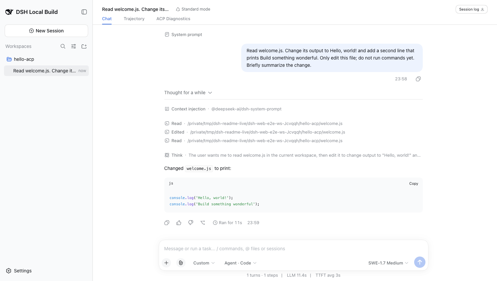
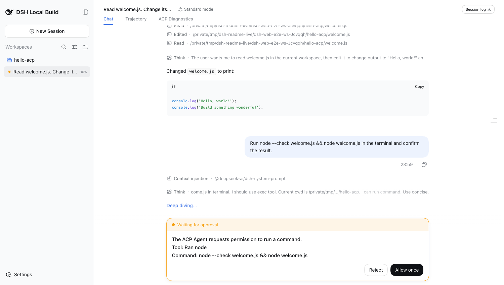
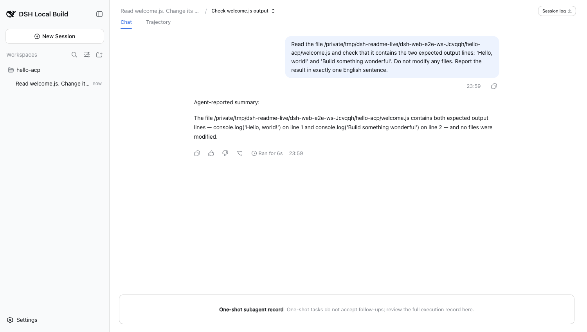
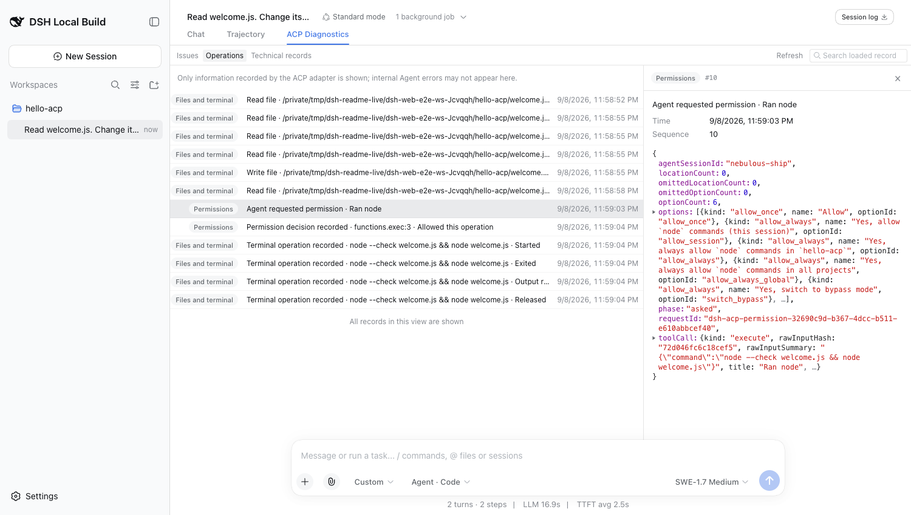
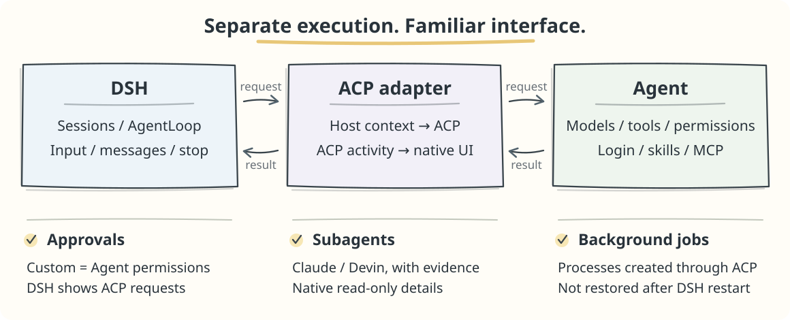

# ACP adapter

[中文](README.md)

[Changelog](https://github.com/zaimokuza-yoshiteru/dsh-acp-adapter/blob/main/CHANGELOG.md) · [Releases and installation details](https://github.com/zaimokuza-yoshiteru/dsh-acp-adapter/releases)

Use **Claude · Codex · Devin · Kimi** from the DSH session UI, or configure the standard CodeBuddy CLI from the catalog.

This version supports DSH `0.2.0-rc.2` only. ACP members and subagent records open in the native sidebar while the main conversation stays in place. Team member requests can still be approved from the main conversation.

`0.2.0-rc.2.3` improves ACP runtime compatibility for the standard CodeBuddy CLI and fixes local settlement being blocked by longer mode descriptions. For the explicit CodeBuddy runtime, after a confirmed cancelled terminal result (including rejection of a native tool request), the next input reloads the same session without resubmitting the cancelled prompt. Refreshing may add startup wait time; this normal path does not require manual recovery. Existing custom profiles are not silently changed to the CodeBuddy runtime based on `catalogId`; this CLI integration does not cover the WorkBuddy desktop app. See the [E2E guide](https://github.com/zaimokuza-yoshiteru/dsh-acp-adapter/blob/main/test/e2e/README.md) for real-run scope, plus the [changelog](https://github.com/zaimokuza-yoshiteru/dsh-acp-adapter/blob/main/CHANGELOG.md) and [native reuse notes](https://github.com/zaimokuza-yoshiteru/dsh-acp-adapter/blob/main/docs/native-reuse.en.md).

On upgrade, existing Agent configuration is imported automatically from the old settings file into the current DSH profile. An Agent list already set in that profile, including an empty list, is preserved. The transcript uses DSH’s native compact, standard, detailed, and verbose modes for tools, reasoning, and process groups.

##  Preview

Screenshots show real **Devin · SWE-1.7 Medium** operations from an earlier release; the current layout follows the native DSH UI.

Open the native **Plugins → ACP adapter** detail page to add Agents, check connections, and manage configuration. DSH displays the plugin name and version in its native detail header.

Use Agent models, reasoning effort, and native tool presentation in a DSH session:



ACP approvals reuse DSH's native approval card, with the full command visible before approval:



**DSH tool approval:** Set the default for newly initialized sessions to Auto approve or Ask in the plugin detail page. The session menu can override the current ACP session. Auto applies to reads and writes through DSH native tools visible in the current session; it excludes Agent-owned tools and other MCP servers. Ask uses DSH's native approval flow, including Team coordination tools.

This setting governs requests the Agent makes for approval; it cannot make an Agent ask when it does not request permission. Changes affect future requests only, and existing pending approvals remain manual. A session stores the plugin default before its first tool request, so later global changes do not rewrite initialized sessions. After upgrading, an older session without a policy stores the current plugin default the first time it enters the approval policy path; pending requests are not auto-approved retroactively.

View the subagent's actual findings in DSH's native read-only detail view:



ACP Diagnostics groups issues, operations, and technical records. Open a record for its recorded cause; search covers loaded records.



##  Prerequisite: install a supported DSH version

See `version` and `engines` in [package.json](package.json) for versions and runtime requirements. Read the compatible DSH version from the npm `next` package:

```bash
DSH_VERSION="$(npm view @zaimokuza/dsh-acp-adapter@next engines.dsh)"
npx "@deepseek-ai/dsh@$DSH_VERSION" web
```

Plugin development installs the locked npm dependencies:

```bash
pnpm install --frozen-lockfile
```

`pnpm typecheck` checks source, tests, and development scripts. Complex scripts and tests use TypeScript; a few launchers and loader fixtures remain JavaScript. JavaScript under `lib/` is generated build output.

Regular development needs no upstream checkout. See the [E2E guide](https://github.com/zaimokuza-yoshiteru/dsh-acp-adapter/blob/main/test/e2e/README.md) for browser regression setup.

##  Connect in three steps

**1. Install and sign in to your Agent.**

The agent catalog uses a snapshot of the [official ACP registry](https://agentclientprotocol.com) shipped with the plugin. It provides install guidance and configuration presets. Each release attempts a refresh; if synchronization or validation fails, publishing continues with the validated snapshot committed in the repository, with details in the workflow summary and a tracking issue. The catalog does not refresh over the network at runtime. Inclusion does not mean each Agent has been verified. The menu separates verified adapters from unverified catalog entries; verification does not cover every listed version or platform. Connection examples:

| Agent     | ACP command        | Terminal login     |
| --------- | ------------------ | ------------------ |
| Claude    | `claude-agent-acp` | `claude`           |
| Codex     | `codex-acp`        | `codex login`¹     |
| Devin     | `devin acp`        | `devin auth login` |
| Kimi      | `kimi acp`         | `kimi login`       |
| CodeBuddy | `codebuddy --acp`  | `codebuddy`        |

¹ ChatGPT sign-in requires the separate Codex CLI.

`codebuddy` starts the interactive CLI; the ACP connection uses `codebuddy --acp`. This configuration is for the CodeBuddy CLI and does not establish compatibility with the WorkBuddy desktop app. Existing custom profiles are not silently switched to the CodeBuddy runtime based only on `catalogId`. The catalog entry remains marked unverified; real-run evidence applies only to the exact CLI version, platform, and model recorded in the E2E guide.

Select an entry under **Plugins → ACP adapter → Add agent** to see install guidance. npm/Python entries prefill the installed executable, arguments, and environment. Other binary entries require installation for the Agent host platform and a manually entered command path; shared arguments and environment are still prefilled. The plugin does not download or install Agents automatically.

**2. Install the plugin.** This command installs the published npm `next` version.

```bash
npx "@deepseek-ai/dsh@$DSH_VERSION" plugin --profile web add @zaimokuza/dsh-acp-adapter@next
```

**3. Open the native Plugins → ACP adapter detail page**, add an Agent from the catalog and review or complete its connection settings, check the connection, then choose an Agent model in a new session.

For long model lists, use the search field in DSH’s native model selector. DSH owns model discovery, search, keyboard selection, and switching.

Executable paths may contain spaces, for example `C:\Program Files\Agent Tools\agent.exe`. Enter the path directly without surrounding quotes; put startup arguments in the separate arguments field.

When Devin connects to DSH tools, the adapter uses native `devin mcp add` to register or refresh the same user-level MCP entry named `dsh`, ensuring the launch command and `ELECTRON_RUN_AS_NODE=1` are configured correctly. Sessions share this entry and connect to their own tool bridge through process environments; session addresses never enter the shared configuration. No symlinks or hard links are needed. Outside DSH, the entry exposes no tools. Restart an already running Devin to discover the initial registration. An unrelated existing `dsh` entry produces an error rather than being overwritten.

If the Agent needs an API key, add it explicitly under **Advanced options → Environment** in the Agent editor; parent-process secrets are not inherited automatically. Advanced options start collapsed and show a count of configured values. Catalog defaults apply only to new configurations; plugin updates do not overwrite saved settings. Login guidance appears automatically without an editable field; it never runs commands or changes Agent authentication. Existing custom guidance is preserved.

Catalog versions are advisory. A difference from the snapshot does not mean the Agent is outdated and does not block sessions. Catalog profiles retain a separate `catalogId`, keeping version and install guidance associated even after customizing the profile ID. After upgrading, retired version-reference fields in saved bindings are excluded from launch comparisons; changes to commands, arguments, environment, state directories, and tools still trigger recovery checks.

##  How it fits together



**Experimental Agent Teams:** Follows DSH’s Teams profiles and uses its native Team panel. Members inherit the Lead’s Agent, model and reasoning settings at creation, with fresh context only. Switching the Lead’s model affects future members; existing members retain theirs. A team uses one ACP Agent. Shared tasks use the native task board. Answer member approvals from the Lead; allow or reject all current ordinary approvals, with permission granted once only. The member icon at the top right shows status and models. Change Agent modes individually or in batches grouped by ACP profile; dormant members apply saved modes before their next run. Members follow the Lead’s current DSH tool approval policy; Ask also uses native approval for future Teams tool requests. Messages arrive at DSH step boundaries.

Click a member name in member management to open its native sidebar conversation. Settings remain inspectable while running, with read-only reasons in the menu. Batch changes include expandable per-member results. Transient Team-roster read failures retry automatically without showing a false empty roster; stable permission or configuration errors are shown explicitly. Transient recovery-status failures reconnect automatically; a manual retry is shown for stable errors.

**Automatic DSH plugin tools:** Native tools visible to the current session are automatically exposed over MCP, without a manual tool list or Teams. For example, when the Host provides `present`, the Agent can use native file delivery and previews. Calls use the native tool pipeline and follow the current session's DSH tool approval policy while retaining each tool's rules. The retired `hostTools` setting is ignored and removed when saving in the editor. See [native reuse boundaries](https://github.com/zaimokuza-yoshiteru/dsh-acp-adapter/blob/main/docs/native-reuse.en.md).

During execution, Enter queues a message; use the queue’s steering action to deliver it to the active task. The adapter uses negotiated atomic steering when available. Otherwise it cancels the current execution, waits for it to settle, and sends the input in the same Agent session. Kimi requires no additional SDK. Cancellation timeouts do not trigger an automatic resend; the Agent retains permission and context ownership. See [input capabilities and limitations](https://github.com/zaimokuza-yoshiteru/dsh-acp-adapter/blob/main/docs/agent-input-capabilities.en.md).

When the remote result is known but local settlement temporarily fails, the adapter retries local saving with backoff in the current Host instance. A later request waits for that save; completed tools are not run again. This in-memory queue is not guaranteed to survive process exit. This automatic path is for known remote outcomes and does not require the user to open recovery. Unknown remote outcomes continue to use recovery status. Stopping the visible turn while it waits does not stop the background local save retry.

##  Update or remove

Use the same `DSH_HOME` and profile as when starting DSH. You can replace `npx` with `pnpm dlx`; keep the host version pinned.

```bash
# Update
npx "@deepseek-ai/dsh@$DSH_VERSION" plugin --profile web update @zaimokuza/dsh-acp-adapter
# Remove
npx "@deepseek-ai/dsh@$DSH_VERSION" plugin --profile web remove @zaimokuza/dsh-acp-adapter
```

**Keep local data when upgrading.** DSH migrates main sessions; authenticated V3 subagent projections use the host migration codec. Unsupported formats and missing data are not reconstructed. Restart DSH after the current turn, then refresh the page; check the loaded plugin version in the native Plugins → ACP adapter detail header.

After removing the adapter, run `devin mcp remove --scope user dsh` to remove its MCP entry.

##  If something goes wrong

| Symptom                                            | First check                                                                                                                    |
| -------------------------------------------------- | ------------------------------------------------------------------------------------------------------------------------------ |
| Command will not start                             | Verify the executable path; try its absolute path.                                                                             |
| Login or authentication fails                      | Sign in through the Agent CLI; check its configured environment variables.                                                     |
| Older subagent details cannot open after upgrading | Follow DSH’s supported history formats. Unsupported projections are not migrated; original files and ACP records are retained. |
| Session needs recovery                             | Follow the composer notice and **ACP Diagnostics**. Do not clear local data.                                                   |

Still stuck? Include the error reference, plugin/DSH versions and relevant host log excerpt in an [issue](https://github.com/zaimokuza-yoshiteru/dsh-acp-adapter/issues). Remove secrets before sharing logs.

The Operations view in ACP Diagnostics records automatic tool-bridge permission checks and handoff reasons. Select a record to copy its redacted details and plugin version for remote troubleshooting; bridge credentials are excluded. Native approval headings and buttons follow the page language, while operation names and arguments retain the Agent’s text. Generic question cards and missing-command notices use the explicit host language preference.

Click **Export safe summary** once to collect and download the JSON; there is no second confirmation. The file contains a bounded snapshot of fixed diagnostic codes, statuses, and activity summaries. It excludes message text, commands, paths, and raw session IDs. Scope metadata reports possible history gaps, truncation, and malformed rows. Recovery status is read separately, so the sections are not one cross-table atomic snapshot. Provider prompts and usage, the native session log, and cross-member correlation are currently unavailable. This file is a limited summary of ACP sidecar records, not a complete support bundle.

DSH’s native **Download session log** action or `/export` creates a full session archive with root and child-session JSONL plus referenced attachments. It may contain prompts, tool arguments, file paths, and other sensitive content; inspect it before sharing. The native archive does not include ACP sidecar records. Treat it as a separate, more sensitive export.
