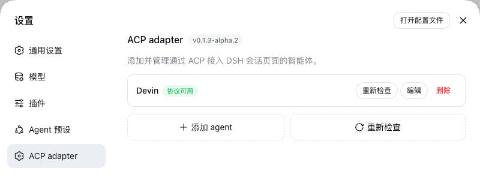
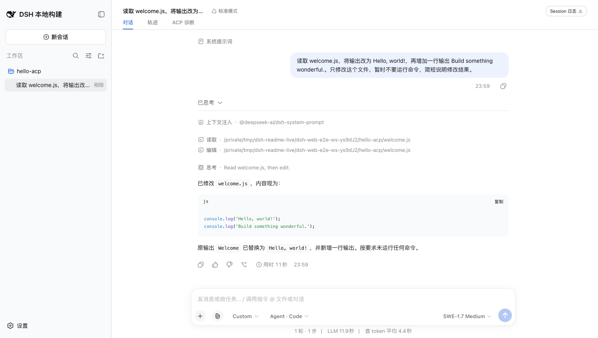
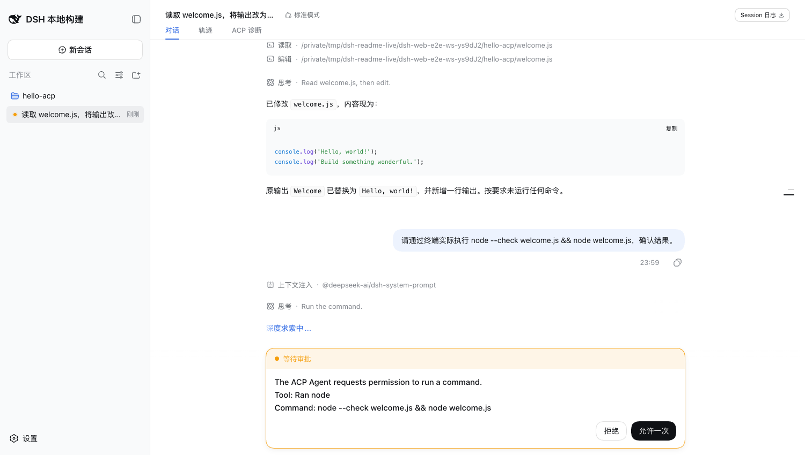
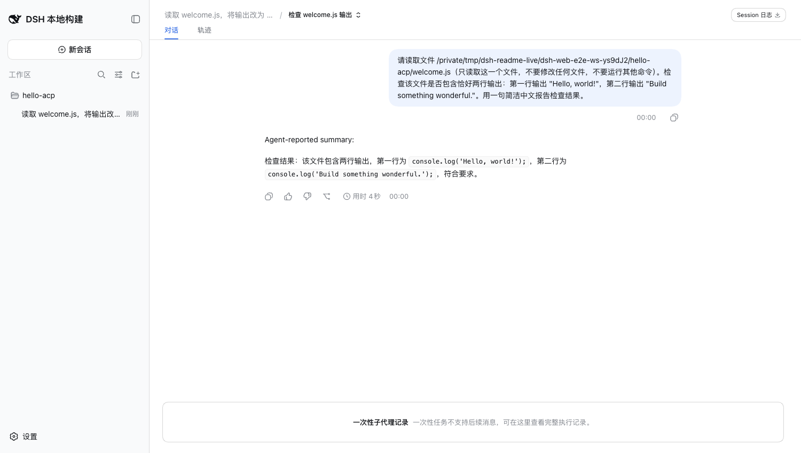
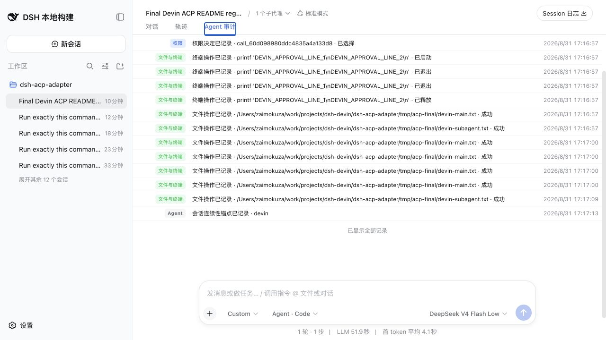

# @zaimokuza/dsh-acp-adapter

[English](README.en.md)

通过 DeepSeek Harness（DSH）会话页面使用智能体，包括 Devin、Codex、Kimi 和 Claude。智能体继续负责自己的模型、工具、skills、登录状态和运行时。

> `feature/0.1.2-alpha` 仅用于适配尚未发布到 npm 的 DSH
> `dsh-v0.1.2-alpha.1` 源码，不是可安装的发布组合。本页以下安装命令仍描述
> main 分支上已发布的版本。普通用户不能从 npm 安装此 Alpha 分支；开发和验收
> 可使用固定 Alpha 源码与本地 tarball，在隔离的 DSH_HOME 中完成安装门禁。

## 功能预览

在 ACP 面板添加 Agent，并检查本地 ACP 命令是否可用：



在 DSH 会话中使用 Agent 模型、推理强度和原生工具：



ACP 审批复用 DSH 原生问题卡；完整命令可多行查看并复制，不会在批准前截断：



Agent 的子 Agent 调用继续使用 DSH 的消息流展示：



通过 Agent 审计查看权限、恢复、文件、配置和会话连续性记录：



## 前置：安装 DSH（main 发布版）

需要 Node.js `^22.19.0 || >=24.0.0` 和当前已发布的 DSH：

```bash
npx @deepseek-ai/dsh web
```

`feature/0.1.2-alpha` 不能通过 npm 安装。要测试这个分支，必须先在本地
检出并构建 `dsh-v0.1.2-alpha.1`，再在本仓库运行：

```bash
pnpm install --frozen-lockfile
pnpm setup:alpha-reference
```

该脚本只链接当前仓库的开发依赖，不修改 DSH 的用户目录；它不是普通用户的安装步骤。

## 安装插件

在运行 DSH 的机器上执行：

```bash
npx @deepseek-ai/dsh plugin --profile web add @zaimokuza/dsh-acp-adapter
npx @deepseek-ai/dsh web
```

打开 DSH 的 ACP 面板，选择内置 Agent 模板、填写必要的可执行文件配置并运行健康检查。模型选择器显示 ACP 会话实际返回的模型与选项。

## 安装并登录 Agent

优先在 Agent 自己的终端安装并登录，再在 ACP 面板执行检查。出于隔离考虑，ACP 子进程不会自动继承名称形似 `KEY`、`TOKEN`、`SECRET` 或 `PASSWORD` 的父进程环境变量；仅当 Agent 没有自己的登录/凭据存储时，才在 ACP profile 的“连接设置”中显式配置它要求的环境变量。密钥值在设置界面中会被遮盖，但仍由用户自行管理。

### Devin

```bash
devin --version
devin auth login
devin auth status
devin acp --help
```

### Codex

`codex-acp` 是 ACP 可执行文件，并已包含兼容的 Codex 运行时。使用 ChatGPT
账号登录时，需要另行安装 Codex CLI 并执行 `codex login`。如果必须使用 API key，
请在 ACP profile 中显式配置 Codex 支持的环境变量；仅在启动 DSH 前 export
`CODEX_API_KEY` 或 `OPENAI_API_KEY` 不会绕过子进程的凭据隔离。插件不会代替
Agent 调用 ACP `authenticate`。

```bash
codex-acp --version
codex-acp --help
# 仅在使用 ChatGPT 账号登录且已安装 Codex CLI 时：
codex login
```

### Kimi

```bash
kimi --version
kimi login
kimi doctor
kimi acp --help
```

### Claude

```bash
claude --version
claude-agent-acp --version
claude-agent-acp --help
```

未登录时优先运行 `claude`，按终端提示完成登录。若使用要求环境变量的兼容端点，请按该 Agent 的说明在 ACP profile 中显式配置所需变量。

## 原生 Agent 访问与边界

ACP 会话自动使用“原生 Agent 访问”。输入框中的 DSH 权限显示为推导出的 `Custom`，仅用于说明权限由 Agent 自己管理；切换这个 DSH 选项不会改变 Agent 的实际权限。Agent 可以使用自己的配置、登录状态、data home、skills 和 MCP 定义。Agent 自己的模式决定其行为；插件只展示 Agent 主动通过 ACP 发出的审批请求，无法限制绕过 ACP 审批的 Agent 工具。请只连接你信任的本地 Agent。

插件不会把 DSH 的 MCP 注入 Agent，也不会读取 DSH 私有配置或要求重复填写 MCP JSON。Agent 已配置的原生 MCP 和 skills 不受影响。当已有历史的会话跨原生 provider 与 ACP Agent 切换时，DSH 会明确要求新建会话，历史不会隐式迁移；原生 provider 内部的模型切换保持 DSH 原有行为，不会被 ACP 会话接管。

原生 provider 的工具由 DSH AgentLoop 执行，因此 Chat 可显示原生工具计数，Trajectory 也能列出每次工具调用。ACP Agent 在自己的进程内执行工具：插件不会伪造 `tool/call` 让 DSH 再执行一次，但会把 ACP 活动归一化后交给 DSH 公共的 Terminal、Read、Diff 等组件。宿主的通用 ToolRow 没有作为公共组件开放，ACP 外层行因此复制它的规格，而不是创建 Agent 专属样式。DSH Trajectory 仍只记录 DSH 实际发出的 provider 请求，ACP 的协议证据保留在 Agent 审计中。

点击 DSH 的 Stop 会先发送 ACP `session/cancel` 通知并等待当前 prompt 结束；正常取消后连接和会话保持可复用。只有 Agent 在有界等待后仍忽略取消时，插件才终止该 Agent 进程并进入恢复流程。

ACP 面板还提供一个默认关闭的“将外部委派加入 DSH 子代理目录”选项。启用后，插件只会把身份、任务和结果均可证明的成功委派保存为 DSH 原生只读会话；目前 Devin 和 Claude 可进入该目录，Kimi 与 Codex 仍只按实际 ACP 活动展示。详情页使用原生用户消息与 assistant 消息展示 Agent 已提供的任务、最终输出或明确标注的摘要；它不是可继续对话的 DSH 子 Agent，也不会补造外部 Agent 未通过 ACP 暴露的内部轨迹。

## 升级与卸载

升级已安装的插件：

```bash
npx @deepseek-ai/dsh plugin --profile web update @zaimokuza/dsh-acp-adapter
```

### 预发布版本的数据兼容

`0.1.0` 正式版之前不保证 ACP sidecar 数据跨版本兼容。如果升级后旧会话提示
“ACP 会话需要恢复”或 `profile-changed`，请先停止 DSH，再备份并重建插件私有数据：

macOS / Linux：

```bash
mv "$HOME/.dsh/dsh-acp" "$HOME/.dsh/dsh-acp.backup"
```

Windows PowerShell：

```powershell
Rename-Item "$env:USERPROFILE\.dsh\dsh-acp" "dsh-acp.backup"
```

重启 DSH 后请创建一个全新的 DSH 会话。该目录只包含插件的 ACP binding、恢复状态、
审计和选项快照；不会删除 Agent 自己的登录、skills、MCP 或 data home。
旧 ACP 会话的 DSH 页面历史仍可查看，但清理 binding 后不能继续恢复。无需删除整个
`~/.dsh/profiles/web`。

卸载：

```bash
npx @deepseek-ai/dsh plugin --profile web remove @zaimokuza/dsh-acp-adapter
```

## 最短故障排查

在 DSH ACP 面板重新运行健康检查；确认对应 Agent 的 `--version`、`--help` 或健康命令成功，并确认 ACP 可执行文件位于 DSH 进程继承的 `PATH` 中。登录状态改变后先在 Agent CLI 完成登录，再点“重新检查”。
