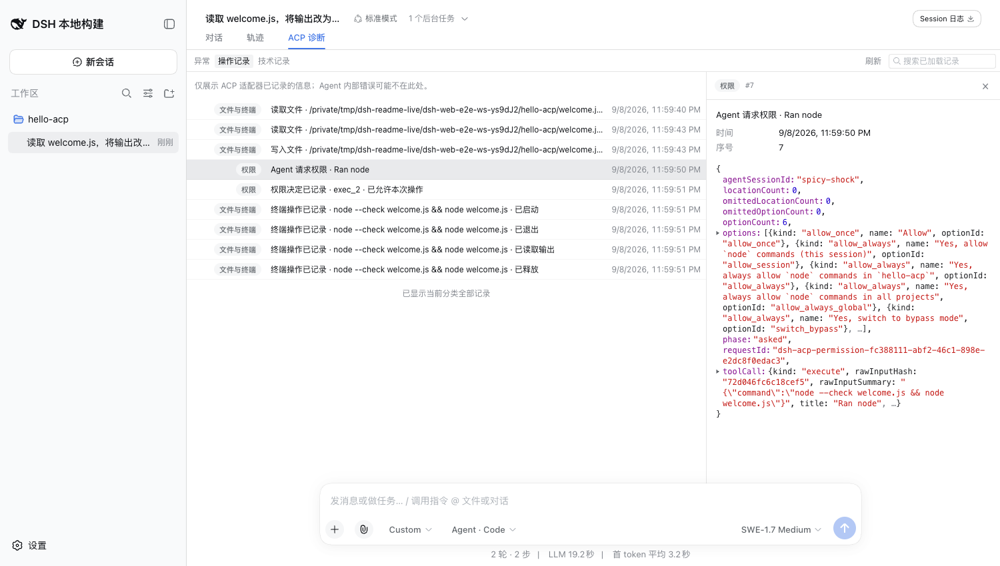
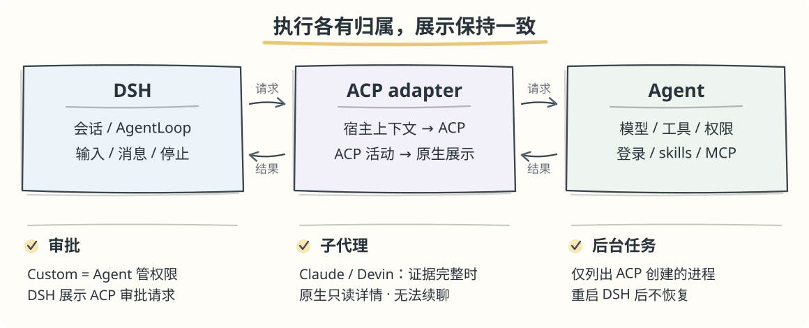

# ACP adapter

[English](README.en.md)

在 DSH 会话页面使用 **Claude · Codex · Devin · Kimi**。

> **0.1.5-alpha.1** · 兼容 **DSH 0.1.5-alpha.1**

##  功能预览

以下截图在干净 DSH 实例中，通过 **Devin · SWE-1.7 Medium** 实际操作生成。

添加 Agent、检查连接，并查看插件版本：


在 DSH 会话中使用 Agent 模型、推理强度和原生工具展示组件：


ACP 审批复用 DSH 原生审批卡，批准前可查看完整命令：


子代理的真实检查结果通过 DSH 原生只读详情展示：


“ACP 诊断”查看异常、操作与技术记录；点开详情查看已记录的原因，搜索范围为已加载记录。



##  前置：安装受支持的 DSH

需要 Node.js `^22.19.0 || >=24.0.0`：

```bash
npx @deepseek-ai/dsh@0.1.5-alpha.1 web
```

插件开发直接安装锁定的 npm 依赖：

```bash
pnpm install --frozen-lockfile
```

常规开发无需上游源码；浏览器回归的准备步骤见 [E2E 指南](test/e2e/README.md)。

##  三步接入

**1. 安装 Agent，并在终端登录。**

| Agent | ACP 命令 | 终端登录 |
| --- | --- | --- |
| Claude | `claude-agent-acp` | `claude` |
| Codex | `codex-acp` | `codex login`¹ |
| Devin | `devin acp` | `devin auth login` |
| Kimi | `kimi acp` | `kimi login` |

¹ 使用 ChatGPT 登录需另装 Codex CLI。

**2. 安装插件。** 以下命令安装 npm 已发布的 `alpha` 版本。

```bash
npx @deepseek-ai/dsh@0.1.5-alpha.1 plugin --profile web add @zaimokuza/dsh-acp-adapter@alpha
```

**3. 打开「设置 → ACP adapter」**，添加模板、检查连接，再在新会话中选择 Agent 模型。

需要 API key 时，在 **连接设置 → 环境变量** 中显式配置；不会自动继承父进程的密钥。

##  如何配合



##  更新与卸载

沿用启动 DSH 时的 `DSH_HOME` 和 profile。`npx` 可替换为 `pnpm dlx`，宿主版本保持固定。

```bash
# 更新
npx @deepseek-ai/dsh@0.1.5-alpha.1 plugin --profile web update @zaimokuza/dsh-acp-adapter
# 卸载
npx @deepseek-ai/dsh@0.1.5-alpha.1 plugin --profile web remove @zaimokuza/dsh-acp-adapter
```

**升级时保留本地数据。** 主会话迁移由 DSH 负责；宿主不支持的旧子代理投影不额外迁移。当前轮次结束后重启 DSH、刷新页面，从设置标题旁确认加载版本。

##  遇到问题

| 现象 | 先检查 |
| --- | --- |
| 命令无法启动 | 核对可执行文件路径，尝试填写绝对路径。 |
| 登录或认证失败 | 在 Agent CLI 登录，检查已配置的环境变量。 |
| 升级后旧子代理无法打开 | 遵循 DSH 的历史格式支持范围；不额外迁移旧投影，原文件与 ACP 记录保留。 |
| 会话需要恢复 | 按输入栏提示与 **ACP 诊断** 处理，不要清空本地数据。 |

仍有问题时，在 [Issue](https://github.com/zaimokuza-yoshiteru/dsh-acp-adapter/issues) 附上错误编号、插件/DSH 版本和相关宿主日志片段；分享前移除密钥。
