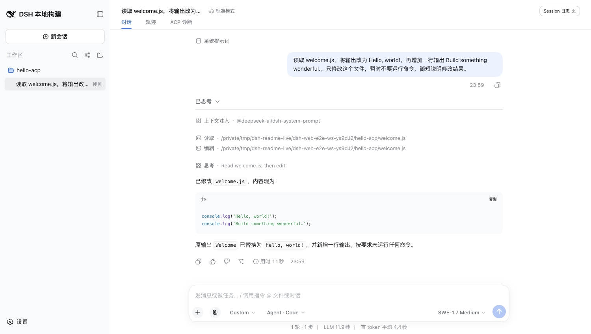
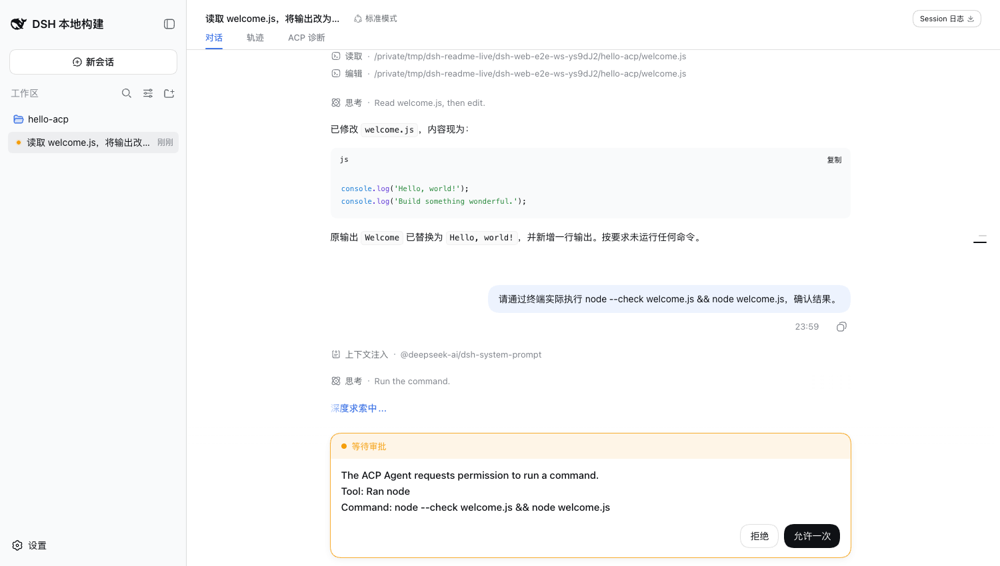
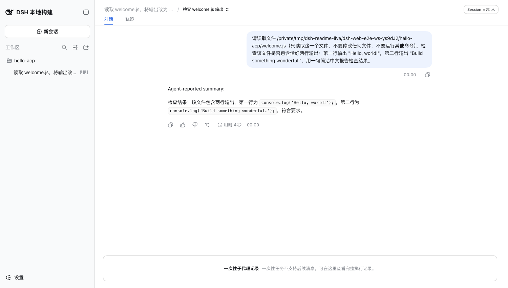
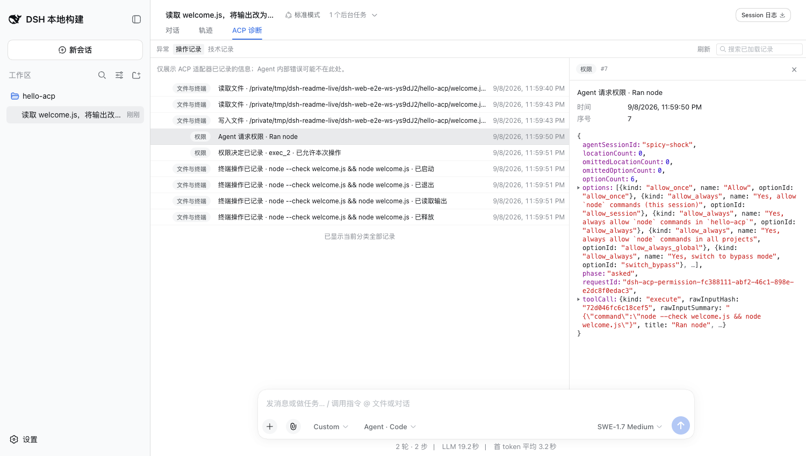

# DSH-ACP-ADAPTER

[English](README.en.md)

在 DSH 中使用 ACP Agent，沿用原生会话、工具审批和团队协作。

> **开发分支 `0.2.1-alpha`：** 正在适配 DSH `0.2.1-alpha.2`，尚未发布；下一个稳定桌面版本验收前不合并 main。兼容改动、可采用能力与 UI/UX 评估见[开发记录](https://github.com/zaimokuza-yoshiteru/dsh-acp-adapter/blob/0.2.1-alpha/docs/dsh-0.2.1-alpha.md)。以下安装说明仍对应已发布版本。

## 安装

当前插件版本 [`0.2.0-rc.2.9`](https://github.com/zaimokuza-yoshiteru/dsh-acp-adapter/releases/tag/v0.2.0-rc.2.9) 兼容 DSH `0.2.0-rc.2`。其他版本见 [Releases](https://github.com/zaimokuza-yoshiteru/dsh-acp-adapter/releases)。

**推荐：** 在 DSH Creator 模式中发送：

> 请安装并启用 ACP 插件：`@zaimokuza/dsh-acp-adapter@next`。

按提示确认即可完成安装并启用。也可打开 **插件 → 添加插件**，粘贴 `@zaimokuza/dsh-acp-adapter@next`，安装后点 **立即启用**。

<details>
<summary>其他安装方式：命令行、Git 与压缩包</summary>

命令行：Desktop 使用其自带的 `dsh` 命令；Web 使用 `npx` 运行官方 DSH CLI npm 包，无需全局安装。

使用 Desktop CLI 前先完全退出应用，执行后重新打开。更新时再次运行对应命令即可，无需先卸载。

```bash
# Desktop
dsh plugin --profile desktop add @zaimokuza/dsh-acp-adapter@next

# Web
npx @deepseek-ai/dsh@0.2.0-rc.2 plugin --profile web add @zaimokuza/dsh-acp-adapter@next
```

Git 与压缩包安装示例：

在插件管理器中，可将下方 Git 地址或 .tgz 包 URL 替换包名粘贴到输入框中。

| 来源              | 示例                                                                                                                                                   |
| ----------------- | ------------------------------------------------------------------------------------------------------------------------------------------------------ |
| Git               | `git+https://github.com/zaimokuza-yoshiteru/dsh-acp-adapter.git#v0.2.0-rc.2.9`                                                                         |
| 预构建插件包 .tgz | [下载 0.2.0-rc.2.9](https://github.com/zaimokuza-yoshiteru/dsh-acp-adapter/releases/download/v0.2.0-rc.2.9/zaimokuza-dsh-acp-adapter-0.2.0-rc.2.9.tgz) |

此包包含编译产物，与 npm 发布包一致。GitHub 自动生成的 Source code ZIP/TAR.GZ 是源码归档，不是构建后的插件包；未缓存的依赖仍需联网安装。

</details>

**更新：** 插件管理器不会自动更新。使用插件管理器更新时，先卸载旧版，再按上方推荐方式安装新版。卸载插件不会卸载 Agent 或退出账号。安装完成后，为确保加载新版：桌面端请在当前任务结束后完全退出并重新打开 DSH；Web 端请重启 DSH 服务并刷新页面。无需重新登录。

## 连接 Agent

插件附带一份 [ACP 官方 Agent 目录](https://agentclientprotocol.com/registry)快照，提供安装、登录指引和命令预填；也可手动添加目录外的 ACP Agent。Agent CLI 必须安装并登录在运行 DSH 的主机上。打开 **插件 → ACP adapter**，按目录指引添加 Agent 并检查连接，再在新会话选择 Agent 模型。插件不会替你安装 CLI 或登录账号。以下 Agent 已做过实际接入测试：

| Agent                      | ACP 命令                                 | 认证               |
| -------------------------- | ---------------------------------------- | ------------------ |
| Devin                      | `devin acp`                              | `devin auth login` |
| CodeBuddy CLI（WorkBuddy） | `codebuddy --acp`                        | `codebuddy`        |
| Antigravity                | `agy_acp_server.par`（官方 raw `1.3.0`） | ACP 独立登录       |
| Claude                     | `claude-agent-acp`                       | `claude`           |
| Codex                      | `codex-acp`                              | `codex login`      |
| Kimi                       | `kimi acp`                               | `kimi login`       |

> CodeBuddy CLI 与 WorkBuddy 桌面端使用同一账号积分，无需分别订阅；通过 CodeBuddy CLI 接入 DSH。详见 [CodeBuddy 账号与订阅说明](https://www.codebuddy.cn/docs/ide/Account/pricing)及 [ACP 命令参考](https://www.codebuddy.cn/docs/cli/cli-reference)。

各 Agent 的具体真实运行范围见 [E2E 验证记录](https://github.com/zaimokuza-yoshiteru/dsh-acp-adapter/blob/main/test/e2e/README.md)。

## 功能预览



<details>
<summary>更多界面预览</summary>







</details>

**Auto** 自动批准当前会话的 DSH 原生工具请求；**Ask** 在 Agent 请求审批时显示原生审批卡。Agent 自带工具仍由 Agent 控制。**Stop** 停止当前轮次；按 Enter 可排队输入，支持的 Agent 会在同一 Agent 会话继续。开启 DSH 的实验性 Agent Teams 后，可在主会话查看成员进度并处理审批。

## 排障与反馈

| 现象                 | 先检查                                                         |
| -------------------- | -------------------------------------------------------------- |
| 命令无法启动         | 核对 Agent 可执行文件路径，尝试填写绝对路径。                  |
| 登录或认证失败       | 在 Agent CLI 登录，并检查已配置的环境变量。                    |
| 旧子代理详情无法打开 | 查看原生恢复提示；不兼容的旧详情会保留在本地记录中并显示错误。 |
| 会话提示需要恢复     | 按输入栏提示和 **ACP 诊断** 操作，不要清空本地数据。           |

在 **ACP 诊断**中可导出安全摘要 JSON；其中不含消息正文、命令、路径、原始会话 ID 或 ACP 凭据。DSH 原生会话日志 ZIP 可能含提示词、工具参数、文件路径和附件；分享前请检查并移除敏感信息。

需要求助时，向 [Issue](https://github.com/zaimokuza-yoshiteru/dsh-acp-adapter/issues) 附上错误编号、DSH/插件版本和已脱敏的日志片段。技术边界见[原生复用说明](https://github.com/zaimokuza-yoshiteru/dsh-acp-adapter/blob/main/docs/native-reuse.md)。
